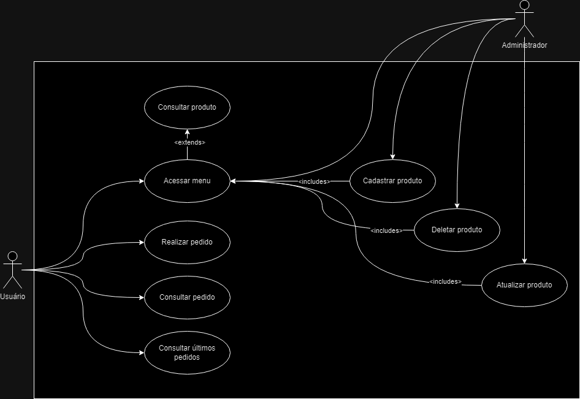
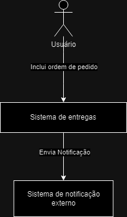
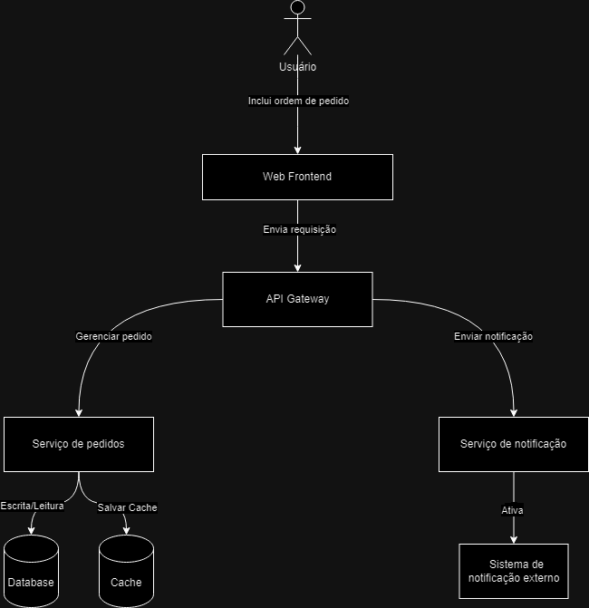

# Sistema de gestão de pedidos

---

## Objetivo

### Introdução

O Sistema de Gestão de Pedidos pretende revolucionar a forma como as lojas locais gerem os seus pedidos. Ao integrar este sistema, as lojas locais podem aceder a uma rede de clientes totalmente nova e agilizar o processamento de pedidos.

---

## O projeto

### Quem é o cliente?

Lojas locais que buscam expandir sua base de clientes e agilizar seus processos de pedidos.

### Que problemas ou oportunidades resolveremos?

- Alcance limitado do cliente para lojas locais.
- Gestão ineficiente de pedidos.
- Falta de rastreamento e notificações em tempo real.

### Qual é o benefício que os clientes podem obter?

- Acesso a uma base de clientes mais ampla.
- Gerenciamento simplificado de pedidos.
- Maior satisfação do cliente por meio de rastreamento e notificações em tempo real.

### O que o cliente deseja ou precisa?

- Uma interface fácil de usar para gerenciar pedidos.
- Um sistema confiável e escalável que pode lidar com o crescimento.

### Como será a experiência do cliente ao usar este novo serviço?

Os clientes acharão o sistema intuitivo e fácil de usar. Eles serão capazes de gerenciar pedidos com eficiência prestando um melhor serviço aos seus clientes.

---

## Metodologia

### Como o trabalho foi organizado?

O trabalho foi organizado utilizando uma abordagem Kanban, o que permitiu maior flexibilidade e foco na entrega contínua de valor. O quadro Kanban foi dividido em várias colunas, como "Novo", "Backlog", "Em desenvolvimento", "Em revisão" e "Feito", para rastrear o status de várias tarefas.

Para manter a alta qualidade, cada tarefa precisava atender a determinados critérios antes de passar para a próxima coluna do quadro Kanban. Code review e testes unitários eram partes essenciais do fluxo de trabalho.

#### Fase inicial: Arquitetura e documentação
A primeira grande entrega foi estrategicamente focada em estabelecer uma base sólida para o projeto. Isso incluiu:

- **Documentação**: Diagramas de Caso de Uso, Diagramas de Contêineres C4, Diagramas de Contexto C4 e Requisitos Funcionais e Não Funcionais foram criados.

- **Arquitetura**: O backend foi desenvolvido utilizando arquitetura Domain-Driven Design (DDD) em C# com dotnet 6.0. O padrão Repository foi implementado usando Entity Framework Core.

#### Desenvolvimento Backend e Frontend
Nesta fase, o foco foi na implementação de funcionalidades e integrações:

- **Backend**: Desenvolvimento de APIs, implementação de testes unitários com xUnit e Moq e segurança.
  
- **Frontend**: Desenvolvimento de componentes em Vue.js, testes de interface e otimização de performance.

#### Integração com Serviços Externos
Nesta fase, o foco foi na integração com serviços externos como Zenvia para notificações e configuração do banco de dados na Amazon Web Services Relational Database Service.

#### Testes
Os testes unitários foram uma parte crucial do desenvolvimento:

- **Teste Unitário**: Os testes unitários foram implementados usando xUnit e a simulação foi feita usando Moq.

#### Implantação e Entrega Final
A última fase envolveu a configuração do ambiente de produção e a entrega final do projeto, que incluiu a documentação final, o código-fonte e o relatório de testes.

### Diagrama de caso de uso:

#### Para o usuário final:
- Navegue pelos produtos: Permite que os usuários finais visualizem uma lista de produtos disponíveis. Recursos como filtragem e classificação podem estar disponíveis para ajudar os clientes a encontrar produtos com mais facilidade.
- Faça a encomenda: Permite que os usuários finais selecionem produtos, adicionem-nos ao carrinho de compras e façam um pedido. Durante este processo, os clientes podem especificar os detalhes da entrega e confirmar o pedido.
- Acompanhar Pedido: Fornece aos usuários finais atualizações em tempo real sobre o status de seus pedidos. Isso pode incluir etapas como “Processamento”, “Saída para entrega” e “Entregue”.
- Ver histórico de pedidos: permite que os usuários finais visualizem uma lista de todos os pedidos anteriores. Esse recurso também pode permitir que os clientes façam novos pedidos de itens de seu histórico.

#### Para o administrador:

- Navegar pelos produtos: Permite que o administrador visualize uma lista de produtos disponíveis. Recursos como filtragem e classificação podem estar disponíveis para ajudar o administrador a encontrar produtos com mais facilidade.
- Cadastrar novos produtos: Permite que o administrador cadastre novos produtos para o sistema.
- Atualizar produtos: Permite que o administrador atualize os produtos existentes no sistema.
- Deletar produtos: Permite que o administrador remova produtos do sistema.



### Requisitos Funcionais

#### Requisitos Funcionais para Clientes

| Código | Identificação | Classificação | Ator | Objetivo |
| --- | --- | --- | --- | --- |
| RF001 | Navegar Produtos  | Essencial | Cliente | Visualizar uma lista de produtos disponíveis |
| RF002 | Realizar Pedido   | Essencial | Cliente | Adicionar produtos ao carrinho e confirmar o pedido |
| RF003 | Consultar Pedido   | Essencial | Cliente | Visualizar informações do pedido em tempo real |
| RF004 | Ver Histórico de Pedidos| Essencial | Cliente | Visualizar e possivelmente refazer pedidos anteriores |

---

#### Requisitos Funcionais para Administradores do Sistema

| Código | Identificação | Classificação | Ator | Objetivo |
| --- | --- | --- | --- | --- |
| RF005 | Gerenciar produtos | Essencial | Administrador do Sistema | Adicionar, remover ou atualizar produtos |
| RF006 | Ver Métricas do Sistema | Essencial | Administrador do Sistema | Visualizar análises relacionadas a pedidos e vendas |

---

#### Requisitos Não Funcionais

| Código | Identificação | Classificação | Objetivo |
| --- | --- | --- | --- |
| RNF001 | Escalabilidade | Essencial | O sistema deve ser escalável horizontalmente |
| RNF002 | Disponibilidade | Essencial | O sistema deve estar disponível 24/7 |
| RNF003 | Redundância | Essencial | Os dados devem ser replicados para tolerância a falhas |
| RNF004 | Segurança | Essencial | Transmissões de dados criptografadas, autenticação forte |
| RNF005 | Desempenho | Essencial | Baixa latência para todas as operações |
| RNF006 | Usabilidade | Essencial | Interface de usuário intuitiva e multiplataforma |
| RNF007 | Recuperação de Desastres | Essencial | Backups regulares e processo de recuperação bem definido |
| RNF008 | Manutenibilidade | Essencial | Fácil de atualizar e bem documentado |
| RNF009 | Conformidade | Essencial | Conformidade com regulamentações legais como o GDPR|


### Diagrama C4 - Contexto



### Diagrama C4 - Container



---

## Tecnologias utilizadas

- **Backend**: C#
- **Frontend**: Vue.js
- **Notification Service**: [Zenvia](https://www.zenvia.com)
- **Database**: SQL Server [AWS RDS](https://aws.amazon.com/pt/rds/?p=ft&c=db&z=3)
- **Frontend Hosting**: [Vercel](https://vercel.com)
- **Backend Hosting**: Amazon Elastic Container Service [AWS ECS](https://aws.amazon.com/pt/ecs/?nc2=h_ql_prod_ct_ecs)

---

## Cronograma do Projeto

| Semana | Entrega Prevista | Descrição |
| --- | --- | --- |
| 1-4 | Documentação | Criação da documentação inicial e planejamento do projeto |
| 4-7 | Desenvolvimento Backend | Implementação dos serviços e APIs do backend em C# |
| 7-9 | Desenvolvimento Frontend | Desenvolvimento da interface do usuário em Vue.js |
| 10 | Testes | Testes unitários com xUnit e Moq |
| 11 | Implantação | Implantação do sistema em ambiente de produção |
| 12-13 | Revisão | Revisão e ajustes finais |
| 14 | Entrega Final | Entrega do projeto e documentação final |


---

## Escopo do projeto

O escopo inclui o desenvolvimento de um sistema de gerenciamento de pedidos baseado na web com rastreamento e notificações em tempo real. Será escalonável, seguro e fácil de usar.

### Escopo do Desenvolvimento do Software

1. **Documentação**
   1.1. Diagramas
       - Diagrama de Caso de Uso
       - Diagrama de Contêineres C4
       - Diagrama de Contexto C4
   1.2. Requisitos Funcionais e Não Funcionais

2. **Desenvolvimento Backend**
   2.1. Configuração Inicial
       - Configuração do Ambiente de Desenvolvimento
       - Definição de Tecnologias e Bibliotecas
   2.2. Implementação de APIs
       - API de Gestão de Pedidos
       - API de Autenticação
   2.3. Implementação do Repositório com Entity Framework Core
       - Modelagem do Banco de Dados
       - Implementação de CRUD para Entidades
   2.4. Implementação de Testes Unitários com xUnit e Moq
       - Testes para Serviços de Negócio
       - Testes para Repositórios
   2.5. Segurança
       - Implementação de Autenticação e Autorização

3. **Desenvolvimento Frontend**
   3.1. Configuração Inicial
       - Configuração do Ambiente de Desenvolvimento
       - Definição de Tecnologias e Bibliotecas
   3.2. Desenvolvimento de Componentes em Vue.js
       - Componentes de Interface de Usuário
       - Componentes de Navegação
   3.3. Integração com APIs do Backend
       - Integração com API de Gestão de Pedidos
       - Integração com API de Autenticação
   3.4. Testes de Interface
       - Testes Unitários para Componentes Vue.js
       - Testes de Integração de Ponta a Ponta
   3.5. Otimização de Performance
       - Lazy Loading
       - Otimização de Assets

4. **Integração com Serviços Externos**
   4.1. Integração com Zenvia para Notificações
   4.2. Configuração de Banco de Dados em AWS RDS

5. **Testes**
   5.1. Testes Unitários
   5.2. Testes de Integração
   5.3. Testes de Carga e Desempenho

6. **Implantação**
   6.1. Configuração de Ambiente de Produção
   6.2. Deploy do Backend em AWS ECS
   6.3. Deploy do Frontend em Vercel

7. **Entrega Final**
   7.1. Documentação Final
   7.2. Código Fonte
   7.3. Relatório de Testes

---

## Contexto

O projeto é voltado para lojas locais que desejam ampliar sua base de clientes e agilizar seus processos de pedidos.

---

## Iniciando o Projeto

Este projeto utiliza diversas tecnologias e serviços. Abaixo estão as instruções básicas para configurar cada parte do projeto.

### Pré-requisitos

- .NET SDK para C#
- Node.js e npm para Vue.js
- Conta na Zenvia (opcional para notificações)
- SQL Server LocalDB ou SQL Server Express para execução local do banco de dados

### Configuração do Backend em C#

1. **Clone o Repositório**
    ```bash
    git clone https://github.com/jvst1/Portfolio.git
    ```
   
2. **Navegue até o diretório do backend**
    ```bash
    cd Portfolio/backend
    ```

3. **Restaure os pacotes NuGet**
    ```bash
    dotnet restore
    ```

4. **Execute o Projeto**
    ```bash
    dotnet run
    ```

### Configuração do Frontend em Vue.js

1. **Navegue até o diretório do frontend**
    ```bash
    cd Portfolio/frontend
    ```

2. **Instale as Dependências**
    ```bash
    npm install
    ```

3. **Execute o Projeto**
    ```bash
    npm run serve
    ```

### Configuração da Zenvia para Notificações (Opcional)

1. **Acesse o painel da Zenvia e configure seu token de API.**

2. **Adicione as variáveis de ambiente relacionadas à Zenvia no seu projeto backend.**

### Configuração do Banco de Dados

#### Opção 1: AWS RDS (Opcional)

1. **Acesse o console da AWS e configure uma nova instância do RDS para SQL Server.**

2. **Atualize a string de conexão no seu projeto backend.**

#### Opção 2: Execução Local

1. **Instale o SQL Server LocalDB ou SQL Server Express.**

2. **Atualize a string de conexão no seu projeto backend para apontar para sua instância local.**

### Nota sobre Execução Local

Este projeto foi configurado para rodar inteiramente na máquina do usuário, sem necessidade de deploy em servidores externos.

---