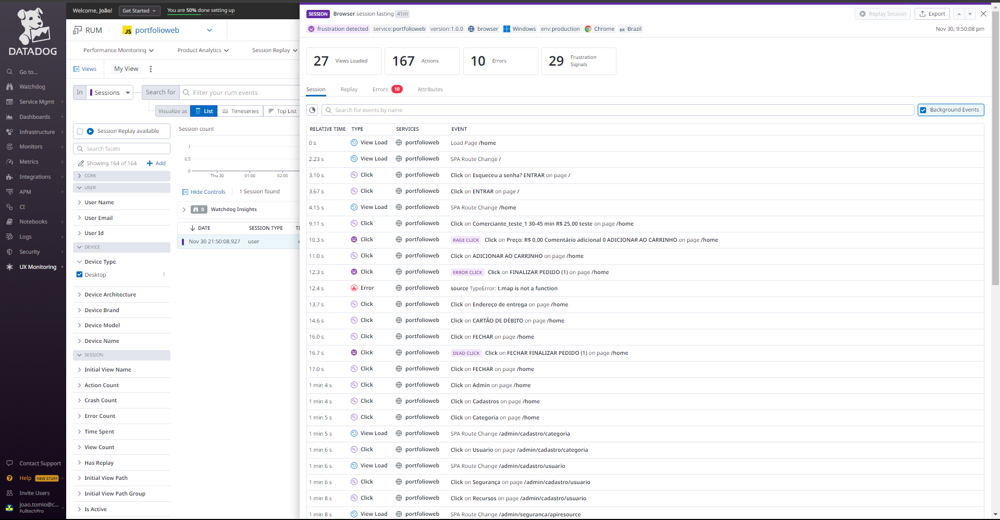
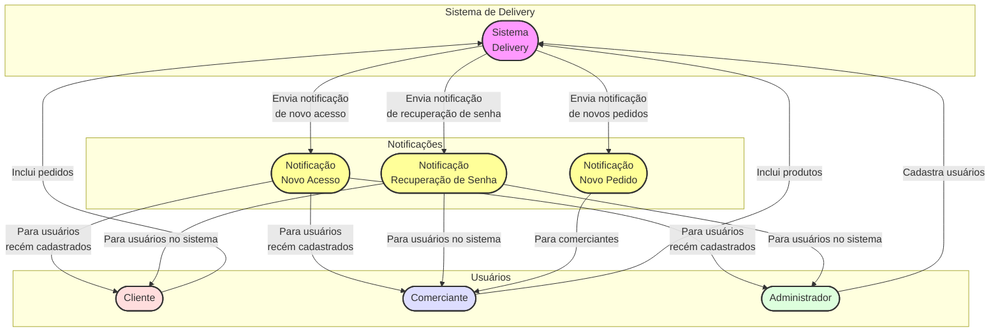

# Sistema de gestão de pedidos

---

## Objetivo

### Introdução

O delivery pretende impulsionar o movimento de clientes em estabelecimentos comerciais locais. Ao integrar este sistema, os estabelecimentos comerciais locais podem aceder a uma rede de clientes totalmente nova e agilizar o processamento de pedidos.

---

## O projeto

### Quem é o cliente?

Estabelecimentos comerciais locais que buscam expandir sua base de clientes e automatizar o processo de anotar o pedido do cliente.

### Que problemas ou oportunidades resolveremos?

- Alcance limitado do cliente para lojas locais.
- Gestão ineficiente de pedidos.

### Qual é o benefício que os clientes podem obter?

- Acesso a uma base de clientes mais ampla.
- Gerenciamento simplificado de pedidos.
- Maior satisfação do cliente.

### O que o cliente deseja ou precisa?

- Uma interface fácil de usar para gerenciar pedidos.
- Um sistema confiável e escalável que pode lidar com o crescimento.

### Como será a experiência do cliente ao usar este novo serviço?

Os clientes acharão o sistema intuitivo e fácil de usar. Eles serão capazes de gerenciar pedidos com eficiência prestando um melhor serviço aos seus clientes.

---

## Metodologia

### Como o trabalho foi organizado?

O trabalho foi organizado utilizando uma abordagem Kanban, o que permitiu maior flexibilidade e foco na entrega contínua de valor. O quadro Kanban foi dividido em várias colunas, como "Novo", "Backlog", "Em desenvolvimento", "Em revisão" e "Feito", para rastrear o status de várias tarefas.

Para manter a alta qualidade, cada tarefa precisava atender a determinados critérios antes de passar para a próxima coluna do quadro Kanban. Code review e testes unitários eram partes essenciais do fluxo de trabalho.

#### Fase inicial: Arquitetura e documentação
A primeira grande entrega foi estrategicamente focada em estabelecer uma base sólida para o projeto. Isso incluiu:

- **Documentação**: Diagramas de Caso de Uso, Diagramas de Contêineres C4, Diagramas de Contexto C4 e Requisitos Funcionais e Não Funcionais foram criados.

- **Arquitetura**: O backend foi desenvolvido utilizando arquitetura Domain-Driven Design (DDD) em C# com dotnet 6.0. O padrão Repository foi implementado usando Entity Framework Core.

#### Desenvolvimento Backend e Frontend
Nesta fase, o foco foi na implementação de funcionalidades e integrações:

- **Backend**: Desenvolvimento de APIs, implementação de testes de API com datadog e segurança.
  
- **Frontend**: Desenvolvimento de componentes em Vue.js e otimização de performance.

#### Integração com Serviços Externos
Nesta fase, o foco foi na integração com serviços externos como AWS Simple Email Service para notificações e configuração do banco de dados na Amazon Web Services Relational Database Service.

#### Testes e monitoramento
Os testes de API foram uma parte crucial do desenvolvimento:

- **Teste de API**: Os testes de API foram implementados usando a ferramenta synthetic tests do Datadog.
- 

- Os testes podem ser feitos de maneira simples, encadeados ou simulando o browser:
  
- Exemplo de teste individual:

  
- Exemplo de teste encadeado:


- Exemplo de teste E2E no navegador:

  
- Foi utilizado o datadog RUM (Real User Monitoring) para acompanhar o desempenho da aplicação e mapear as sessões de usuários. 




- Foi implementado o Sonarcloud para análise de código: [link para acesso](https://sonarcloud.io/summary/overall?id=jvst1_Portfolio)


#### Implantação e Entrega Final
A última fase envolveu a configuração do ambiente de produção e a entrega final do projeto, que incluiu a documentação completa, o código-fonte e a garantia dos processos hospedados na AWS, Github e Vercel.

### Casos de uso:
### Para o Usuário Final:

#### Caso de Uso: Navegar pelos Produtos
- **Descrição**: O usuário final pode visualizar uma lista de produtos disponíveis no site. Recursos como filtragem e ordenação estão disponíveis para facilitar a busca de produtos específicos.
- **Atores**: Usuário final.
- **Pré-condições**: Nenhuma.
- **Fluxo Principal**:
  1. O usuário acessa a seção de produtos.
  2. O usuário utiliza filtros e opções de ordenação, se desejar.
  3. O sistema exibe os produtos conforme os critérios selecionados.
- **Pós-condições**: O usuário consegue visualizar os produtos de seu interesse.

#### Caso de Uso: Fazer Pedido
- **Descrição**: O usuário final seleciona produtos, adiciona-os ao carrinho de compras e finaliza o pedido. Pode especificar detalhes de entrega e confirmar o pedido.
- **Atores**: Usuário final.
- **Pré-condições**: O usuário deve ter navegado pelos produtos e selecionado itens.
- **Fluxo Principal**:
  1. O usuário adiciona produtos ao carrinho.
  2. O usuário visualiza o carrinho e procede para o checkout.
  3. O usuário fornece informações de entrega e pagamento.
  4. O usuário confirma o pedido.
- **Pós-condições**: O pedido é processado pelo sistema.


### Para o Comerciante:

#### Caso de Uso: Navegar pelos Produtos
- **Descrição**: Similar ao caso de uso do usuário final, mas focado na gestão dos produtos pelo comerciante.
- **Atores**: Comerciante.
- **Pré-condições**: Nenhuma.
- **Fluxo Principal**:
  1. O comerciante acessa a seção de produtos.
  2. O comerciante utiliza filtros e opções de ordenação, se desejar.
  3. O comerciante exibe os produtos conforme os critérios selecionados.
- **Pós-condições**: O comerciante consegue visualizar os seus produtos de interesse.


#### Caso de Uso: Cadastrar Novos Produtos
- **Descrição**: O comerciante pode cadastrar novos produtos no sistema.
- **Atores**: Comerciante.
- **Fluxo Principal**:
  1. O comerciante acessa a interface de configuração de cardápio.
  2. O comerciante insere as informações do novo produto.
  3. O sistema valida e registra o novo produto.


#### Caso de Uso: Atualizar Produtos
- **Descrição**: O comerciante atualiza informações de produtos existentes.
- **Atores**: Comerciante.
- **Fluxo Principal**:
  1. O comerciante seleciona um produto para atualizar.
  2. O comerciante modifica as informações necessárias.
  3. O sistema salva as alterações.


#### Caso de Uso: Deletar Produtos
- **Descrição**: O comerciante remove produtos do catálogo.
- **Atores**: Comerciante.
- **Fluxo Principal**:
  1. O comerciante seleciona o produto a ser removido.
  2. O sistema confirma a ação e remove o produto.


### Para o Administrador:

#### Caso de Uso: Navegar pelos Produtos e Estabelecimentos
- **Descrição**: Permite ao administrador visualizar todos os produtos e estabelecimentos cadastrados.
- **Atores**: Administrador.
- **Fluxo Principal**: Similar ao caso de uso de navegar pelos produtos, mas com acesso a todos os produtos e estabelecimentos.


#### Caso de Uso: Cadastrar Novos Usuários
- **Descrição**: O administrador pode cadastrar novos usuários no sistema, atribuindo-lhes diferentes responsabilidades.
- **Atores**: Administrador.
- **Fluxo Principal**:
  1. O administrador acessa o painel de administração.
  2. O administrador insere as informações do novo usuário.
  3. O sistema valida e cria o novo usuário.


#### Caso de Uso: Atualizar Usuários
- **Descrição**: O administrador pode atualizar informações de usuários existentes.
- **Atores**: Administrador.
- **Fluxo Principal**:
  1. O administrador escolhe um usuário para atualizar.
  2. O administrador modifica as informações necessárias.
  3. O sistema salva as alterações.


#### Caso de Uso: Remover Usuários
- **Descrição**: O administrador pode remover usuários do sistema.
- **Atores**: Administrador.
- **Fluxo Principal**:
  1. O administrador seleciona o usuário a ser removido.
  2. O sistema confirma a ação e remove o usuário.


### Requisitos Funcionais

#### Requisitos funcionais para clientes

| Código | Identificação    | Classificação | Ator    | Objetivo                                                                   |
| ------ | ---------------- | ------------- | ------- | -------------------------------------------------------------------------- |
| RF001  | Navegar Produtos | Essencial     | Cliente | Visualizar uma lista de estabelecimentos comerciais e produtos disponíveis |
| RF002  | Realizar Pedido  | Essencial     | Cliente | Adicionar produtos ao carrinho e confirmar o pedido                        |

---

#### Requisitos Funcionais para comerciantes no sistema

| Código | Identificação      | Classificação | Ator                     | Objetivo                                 |
| ------ | ------------------ | ------------- | ------------------------ | ---------------------------------------- |
| RF003  | Gerenciar produtos | Essencial     | Administrador do Sistema | Adicionar, remover ou atualizar produtos |

---

#### Requisitos Funcionais para administradores no sistema

| Código | Identificação           | Classificação | Ator                     | Objetivo                                            |
| ------ | ----------------------- | ------------- | ------------------------ | --------------------------------------------------- |
| RF004  | Gerenciar produtos      | Essencial     | Administrador do Sistema | Adicionar, remover ou atualizar produtos            |
| RF005  | Ver Métricas do Sistema | Essencial     | Administrador do Sistema | Visualizar análises relacionadas a pedidos e vendas |

---

#### Requisitos Não Funcionais

| Código | Identificação            | Classificação | Objetivo                                                  |
| ------ | ------------------------ | ------------- | --------------------------------------------------------- |
| RNF001 | Escalabilidade           | Normal        | O sistema deve ser escalável horizontalmente              |
| RNF002 | Disponibilidade          | Normal        | O sistema deve estar disponível 24/7                      |
| RNF003 | Redundância              | Normal        | Os dados devem ser replicados para tolerância a falhas    |
| RNF004 | Segurança                | Normal        | Transmissões de dados criptografadas, autenticação forte  |
| RNF005 | Desempenho               | Normal        | Baixa latência para todas as operações                    |
| RNF006 | Usabilidade              | Normal        | Interface de usuário intuitiva e multiplataforma          |
| RNF007 | Recuperação de Desastres | Normal        | Backups regulares e processo de recuperação bem definido  |
| RNF008 | Manutenibilidade         | Normal        | Fácil de atualizar e bem documentado                      |
| RNF009 | Conformidade             | Normal        | Conformidade com regulamentações legais como o GDPR       |
| RNF010 | Customização             | Normal        | Customizar perfil do cliente, comerciante e administrador |


### Diagrama C4 - Contexto

### Diagrama C4 - Container


---

## Tecnologias utilizadas

- **Backend**: C#
- **Frontend**: Vue.js
- **Notification Service**: [AWS SES](https://aws.amazon.com/pt/ses/)
- **Database**: SQL Server [AWS RDS](https://aws.amazon.com/pt/rds/)
- **Frontend Hosting**: [Vercel](https://vercel.com)
- **Backend Hosting**: Amazon Elastic Container Service [AWS ECS](https://aws.amazon.com/pt/ecs/)

---

## Cronograma do Projeto

| Semana | Entrega Prevista         | Descrição                                                 |
| ------ | ------------------------ | --------------------------------------------------------- |
| 1-4    | Documentação             | Criação da documentação inicial e planejamento do projeto |
| 4-7    | Desenvolvimento Backend  | Implementação dos serviços e APIs do backend em C#        |
| 7-9    | Desenvolvimento Frontend | Desenvolvimento da interface do usuário em Vue.js         |
| 10     | Testes                   | Testes unitários com xUnit e Moq                          |
| 11     | Implantação              | Implantação do sistema em ambiente de produção            |
| 12-13  | Revisão                  | Revisão e ajustes finais                                  |
| 14     | Entrega Final            | Entrega do projeto e documentação final                   |


---

## Escopo do projeto

O escopo inclui o desenvolvimento de um sistema de gerenciamento de pedidos baseado na web com rastreamento e notificações em tempo real. Será escalonável, seguro e fácil de usar.

### Escopo do Desenvolvimento do Software

1. **Documentação**
   1. Diagramas
      1. Diagrama de Caso de Uso
      2. Diagrama de Contêineres C4
      3. Diagrama de Contexto C4
   2. Requisitos Funcionais e Não Funcionais

2. **Desenvolvimento Backend**
   1. Configuração Inicial
      1. Configuração do Ambiente de Desenvolvimento
      2. Definição de Tecnologias e Bibliotecas
   2. Implementação de APIs
      1. API de Gestão de Pedidos
      2. API de Autenticação
   3. Implementação do Repositório com Entity Framework Core
      1. Modelagem do Banco de Dados
      2. Implementação de CRUD para Entidades
   4. Segurança
      1. Implementação de Autenticação e Autorização

3. **Desenvolvimento Frontend**
   1. Configuração Inicial
      1. Configuração do Ambiente de Desenvolvimento
      2. Definição de Tecnologias e Bibliotecas
   2. Desenvolvimento de Componentes em Vue.js
      1. Componentes de Interface de Usuário
      2. Componentes de Navegação
   3. Integração com APIs do Backend
      1. Integração com API de Gestão de Pedidos
      2. Integração com API de Autenticação
   4. Testes de Interface
      1. Testes de Integração de Ponta a Ponta
   5. Otimização de Performance
      1. Lazy Loading
      2. Otimização de Assets

4. **Integração com Serviços Externos**
   1. Integração com AWS SES para notificações de e-mail
   2. Configuração de Banco de Dados em AWS RDS
   3. Configuração de serviços AWS para hospedagem de ECS
   
5. **Testes**
   1. Testes de API
   2. Testes E2E

6. **Implantação**
   1. Configuração de Ambiente de Produção
      1. Aplicar file-transform para appSettings
      2. Configurar secrets GitHub
      3. Configurar variáveis de ambiente GitHub
   2. Deploy do Backend em AWS ECS
   3. Deploy do Frontend em Vercel

7. **Entrega Final**
   1. Documentação Final
   2. Código Fonte
   3. Relatório de Testes

---

## Contexto

O projeto é voltado para lojas locais que desejam ampliar sua base de clientes e agilizar seus processos de pedidos.

---

## Iniciando o Projeto

Este projeto utiliza diversas tecnologias e serviços. Abaixo estão as instruções básicas para configurar cada parte do projeto.

### Pré-requisitos

- .NET SDK para C#
- Node.js e npm para Vue.js
- Conta ativa na AWS e realizar verificação de domínio para ter acesso ao SES (opcional para notificações)
- SQL Server LocalDB ou SQL Server Express para execução local do banco de dados

### Configuração do Backend em C#

1. **Clone o Repositório**
    ```bash
    git clone https://github.com/jvst1/Portfolio.git
    ```
   
2. **Navegue até o diretório do backend**
    ```bash
    cd Portfolio/backend
    ```

3. **Restaure os pacotes NuGet**
    ```bash
    dotnet restore
    ```

4. **Execute o Projeto**
    ```bash
    dotnet run
    ```

### Configuração do Frontend em Vue.js

1. **Navegue até o diretório do frontend**
    ```bash
    cd Portfolio.Web/portfolio
    ```

2. **Instale as Dependências**
    ```bash
    npm install
    ```

3. **Execute o Projeto**
    ```bash
    npm run serve
    ```

### Configuração da AWS SES para notificações (Opcional)

1. **Seguir passo a passo a documentação oficial https://docs.aws.amazon.com/pt_br/ses/latest/dg/send-email-concepts-process.html**

### Configuração do Banco de Dados

#### Opção 1: AWS RDS (Opcional)

1. **Acesse o console da AWS e configure uma nova instância do RDS para SQL Server.**

2. **Atualize a string de conexão no seu projeto backend.**

#### Opção 2: Execução Local

1. **Instale o SQL Server LocalDB ou SQL Server Express.**

2. **Atualize a string de conexão no seu projeto backend para apontar para sua instância local.**

### Nota sobre Execução Local

Este projeto não foi configurado para rodar inteiramente na máquina do usuário, sem necessidade de deploy em servidores externos.

---
